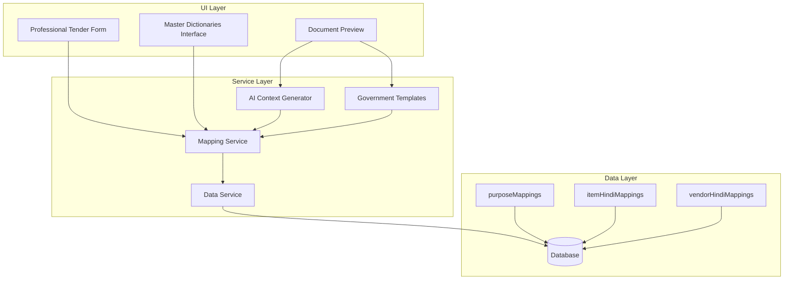

# Design Document: Document Generation Enhancement

## Overview

This feature addresses the need to professionalize government tender document generation in the Magra Automation system. Currently, Vigyapti (Tender Notice) and Supply Aadesh (Supply Order) documents are generated using raw item names directly in the narrative, which appears unprofessional and mechanical. Government documents should be generated from the purpose/category of procurement, not raw item names.

The enhancement introduces a procurement purpose library system that maps procurement categories to professional procurement purposes, provides Hindi transliteration for item names and supplier names, and improves document subjects and narratives using standardized government wording.

### Key Objectives

1. **Professional Document Generation**: Replace raw item names with professional procurement purposes in Vigyapti and Supply Aadesh documents
2. **Hindi Transliteration**: Display Hindi phonetic names in item tables and supplier names for better readability
3. **Estimated Amount Field**: Add "अनुमानित राशि" field to Tender for standardized budget planning
4. **Reusable Master Dictionaries**: Maintain purpose, item Hindi, and vendor Hindi mappings for sharing across tenders
5. **Backward Compatibility**: Ensure seamless integration with existing document generation services

### Scope

- New services: `mappingService` (simplified)
- Database collections: `purposeMappings`, `itemHindiMappings`, `vendorHindiMappings`
- Modified services: `aiContextGenerator`, `governmentTemplates`, `dataService`
- Modified components: `professionalTenderForm`, document preview components

## Architecture

### System Architecture



### Component Relationships

1. **ProfessionalTenderForm**: Main tender creation interface that integrates with mapping service
2. **Master Dictionaries Interface**: Dedicated UI for managing all mapping dictionaries
3. **MappingService**: Simplified service for managing purpose and Hindi mappings
4. **AIContextGenerator**: Extended to use Purpose Library for generating purpose lines
5. **GovernmentTemplates**: Updated to use professional procurement purposes in Vigyapti and Supply Aadesh generation

## Components and Interfaces

### New Service: MappingService

A simplified service that handles both purpose mappings and Hindi transliteration.

**Key Functions:**

**Purpose Mappings:**
- `getPurposeByCategory(category: string, language?: Language)`: Retrieve professional purpose for a category
- `setPurposeByCategory(category: string, purpose: string, language: Language)`: Set professional purpose for a category
- `getAllPurposeMappings()`: Retrieve all purpose mappings
- `deletePurposeMapping(category: string)`: Remove a purpose mapping

**Hindi Transliteration:**
- `getHindiItemName(itemName: string)`: Retrieve stored Hindi name or generate new one
- `setHindiItemName(itemName: string, hindiName: string)`: Store Hindi name for an item
- `getHindiVendorName(vendorName: string)`: Retrieve stored Hindi name or generate new one
- `setHindiVendorName(vendorName: string, hindiName: string)`: Store Hindi name for a vendor
- `getAllItemHindiMappings()`: Retrieve all item Hindi mappings
- `getAllVendorHindiMappings()`: Retrieve all vendor Hindi mappings

**Data Structures:**
```typescript
interface PurposeMapping {
  id: string;
  category: string;  // e.g., "fire_fighting", "water_supply"
  professionalPurpose: string;
  language: 'hindi' | 'english';
  usageCount: number;
  isAutoGenerated: boolean;
  createdAt: string;
  updatedAt: string;
}

interface HindiMapping {
  id: string;
  englishName: string;
  hindiName: string;
  type: 'item' | 'vendor';
  usageCount: number;
  isAutoGenerated: boolean;
  createdAt: string;
  updatedAt: string;
}
```

**Transliteration Approach:**
- Check saved mapping first
- If missing: call AI transliteration API once
- Save result and reuse forever
- No complex phonetic engine needed

### Modified Services

#### AIContextGenerator (Extended)

**New Functions:**
- `generatePurposeLine(items: TenderItem[], language: Language)`: Generate professional purpose line using category-based mapping
- `generateVigyaptiIntroWithPurpose(placeName: string, districtName: string, items: TenderItem[], language: Language)`: Generate Vigyapti intro using professional purposes
- `generateSupplyAadeshSubjectWithPurpose(items: TenderItem[], language: Language)`: Generate Supply Aadesh subject using professional purposes

**Backward Compatibility:**
- All existing functions remain unchanged
- New functions use Purpose Library when available, fall back to current behavior otherwise
- When no mapping exists, use temporary purpose: "संबंधित कार्य हेतु आवश्यक सामग्री"

#### GovernmentTemplates (Updated)

**Modified Functions:**
- `generateVigyapti()`: Now uses professional procurement purposes from Purpose Library
- `generateSupplyAadesh()`: Now uses professional procurement purposes for subjects
- `generateMunicipalCorporationVigyapti()`: Updated to use professional purposes
- `generateMunicipalCorporationSupplyAadesh()`: Updated to use professional purposes

**Backward Compatibility:**
- All existing functionality preserved
- Professional purposes used when available, raw item names used as fallback

#### DataService (Extended)

**New Methods:**
- `purposeMappings`: CRUD operations for purpose mappings
- `itemHindiMappings`: CRUD operations for item Hindi mappings
- `vendorHindiMappings`: CRUD operations for vendor Hindi mappings

## Data Models

### Purpose Mapping (Category-Based)

```typescript
interface PurposeMapping {
  id: string;
  category: string;  // e.g., "fire_fighting", "water_supply", "chemicals"
  professionalPurpose: string;
  language: 'hindi' | 'english';
  usageCount: number;
  isAutoGenerated: boolean;
  createdAt: string;
  updatedAt: string;
}
```

**Database Collection:** `purposeMappings`

**Fields:**
- `category`: String - The procurement category (e.g., "fire_fighting")
- `professionalPurpose`: String - The professional procurement purpose in Hindi/English
- `language`: Enum - 'hindi' | 'english'
- `usageCount`: Number - Track how often this mapping is used
- `isAutoGenerated`: Boolean - Whether this was auto-generated or user-provided
- `createdAt`: Timestamp
- `updatedAt`: Timestamp

**Example:**
```json
{
  "category": "fire_fighting",
  "professionalPurpose": "अग्निशमन एवं जल आपूर्ति कार्य हेतु आवश्यक सामग्री",
  "language": "hindi",
  "usageCount": 5,
  "isAutoGenerated": false,
  "createdAt": "2026-05-30T...",
  "updatedAt": "2026-05-30T..."
}
```

### Item Hindi Mapping

```typescript
interface HindiMapping {
  id: string;
  englishName: string;
  hindiName: string;
  type: 'item' | 'vendor';
  usageCount: number;
  isAutoGenerated: boolean;
  createdAt: string;
  updatedAt: string;
}
```

**Database Collection:** `itemHindiMappings`

**Fields:**
- `englishName`: String - The English item or vendor name
- `hindiName`: String - The Hindi phonetic transliteration
- `type`: Enum - 'item' | 'vendor'
- `usageCount`: Number
- `isAutoGenerated`: Boolean - Whether this was auto-generated or user-provided
- `createdAt`: Timestamp
- `updatedAt`: Timestamp

### Vendor Hindi Mapping

Same structure as Item Hindi Mapping, stored in `vendorHindiMappings` collection.

### Estimated Amount at Tender Level

```typescript
interface Tender {
  // ... existing fields ...
  estimatedAmount?: number;  // New field for total estimated budget
}
```

**Fields:**
- `estimatedAmount`: Number - Total estimated budget for the tender (optional)

## Correctness Properties

*A property is a characteristic or behavior that should hold true across all valid executions of a system-essentially, a formal statement about what the system should do. Properties serve as the bridge between human-readable specifications and machine-verifiable correctness guarantees.*

### Property 1: Purpose Library Lookup by Category

*For any* category and language, if a purpose mapping exists in the Purpose Library, the lookup function shall return the exact professional purpose that was stored, preserving all characters and formatting.

**Validates: Requirements 1.2, 1.4**

### Property 2: Purpose Library Persistence

*For any* valid purpose mapping, after storing it in the Purpose Library, a subsequent lookup for the same category and language shall return the exact same mapping, including all metadata fields.

**Validates: Requirements 1.1, 1.3, 1.5**

### Property 3: Purpose Consolidation by Category

*For any* set of tender items, the consolidation function shall produce a single professional narrative using the categories of the items, with proper grammatical connectors for multiple categories.

**Validates: Requirements 1.6**

### Property 4: Hindi Transliteration Reuse

*For any* English text that has been transliterated to Hindi and saved, a subsequent lookup shall return the exact same Hindi text without calling the AI API again.

**Validates: Requirements 2.4, 4.4**

### Property 5: Document Generation with Purpose

*For any* tender with items that have professional purposes in the Purpose Library, the generated Vigyapti and Supply Aadesh documents shall contain the professional purposes instead of raw item names in all narrative sections.

**Validates: Requirements 1.4, 5.1, 6.1**

### Property 6: Document Generation Fallback

*For any* tender with items that do not have professional purposes in the Purpose Library, the generated Vigyapti and Supply Aadesh documents shall use a temporary purpose ("संबंधित कार्य हेतु आवश्यक सामग्री"), maintaining backward compatibility.

**Validates: Requirements 8.2**

### Property 7: Language-Specific Narrative Generation

*For any* tender with a specified language (hindi or english), the generated narrative shall use the appropriate language for all professional purposes, with proper grammatical structure for that language.

**Validates: Requirements 5.4, 6.3**

### Property 8: Estimated Amount at Tender Level

*For any* tender with an estimated amount, the generated Vigyapti document shall display the estimated amount at the tender level, not per item.

**Validates: Requirements 3.1, 3.4**

### Property 9: Dictionary Import/Export Consistency

*For any* set of mappings (purpose, item Hindi, or vendor Hindi), after exporting to JSON and re-importing, the dictionary shall contain all mappings with identical data, including all metadata fields.

**Validates: Requirements 7.4**

### Property 10: Template Selection Consistency

*For any* tender with a department profile, the document generation shall use the correct template (standard vs. Municipal Corporation) based on the department name, regardless of whether professional purposes are used.

**Validates: Requirements 5.5, 6.5**

## Error Handling

### Purpose Library Errors

1. **Mapping Not Found**: When no purpose mapping exists for a category, the system shall:
   - Log the missing mapping for audit purposes
   - Use temporary purpose: "संबंधित कार्य हेतु आवश्यक सामग्री"
   - No user prompt during tender creation

2. **Database Error**: When database operations fail:
   - Return error to calling service
   - Log error with context (category, operation type)
   - Use temporary purpose as fallback

### Hindi Transliteration Errors

1. **Invalid Input**: When input contains non-ASCII characters:
   - Log warning with input sample
   - Return original text unchanged
   - Continue processing with fallback

2. **AI API Error**: When transliteration API fails:
   - Log error with input text
   - Return original text unchanged
   - Continue processing

### Dictionary Manager Errors

1. **Import Format Error**: When imported data is invalid JSON:
   - Return error message with details
   - Do not modify existing dictionary
   - Provide clear error message to user

2. **Validation Error**: When mapping data is invalid:
   - Return specific validation errors
   - Do not store invalid data
   - Provide clear error message to user

## Testing Strategy

### Dual Testing Approach

**Unit Tests**: Verify specific examples, edge cases, and error conditions
**Property Tests**: Verify universal properties across all inputs (when applicable)

### Property-Based Testing

The following properties will be tested using property-based testing (PBT):

1. **Purpose Library Lookup Consistency** (Property 1)
2. **Purpose Library Persistence** (Property 2)
3. **Purpose Consolidation Completeness** (Property 3)
4. **Hindi Transliteration Round-Trip** (Property 4)
5. **Hindi Mapping Persistence** (Property 5)
6. **Document Generation with Purpose** (Property 6)
7. **Document Generation Fallback** (Property 7)
8. **Language-Specific Narrative Generation** (Property 8)
9. **Dictionary Import/Export Consistency** (Property 9)
10. **Template Selection Consistency** (Property 10)

### Unit Tests

**Mapping Service:**
- Test CRUD operations for purpose mappings by category
- Test lookup with exact match, partial match, and no match
- Test consolidation with 1, 2, 3, and 10+ items
- Test language-specific purpose retrieval
- Test Hindi transliteration for known items
- Test AI transliteration API call for unknown items
- Test fallback behavior for invalid input
- Test storage and retrieval of Hindi mappings

**Integration Tests:**
- Test end-to-end document generation with professional purposes
- Test fallback to temporary purpose when no mapping exists
- Test language switching in document generation
- Test template selection based on department type

**Integration Tests:**
- Test end-to-end document generation with professional purposes
- Test fallback to raw item names when no mapping exists
- Test language switching in document generation
- Test template selection based on department type

### Test Configuration

- **Property-based tests**: Minimum 100 iterations per property
- **Unit tests**: Cover all edge cases and error conditions
- **Integration tests**: Cover all major workflows

### Tag Format for Property Tests

Each property-based test shall be tagged with:
```
Feature: document-generation-enhancement, Property {number}: {property_text}
```

## Implementation Plan

### Phase 1: Core Services (Week 1-2)

1. Implement `MappingService` (simplified service for purpose and Hindi mappings)
2. Add database collections for mappings (purposeMappings, itemHindiMappings, vendorHindiMappings)
3. Add estimatedAmount field to Tender type

### Phase 2: Integration (Week 3)

1. Extend `AIContextGenerator` with new functions
2. Update `GovernmentTemplates` to use professional purposes
3. Extend `DataService` with mapping CRUD operations

### Phase 3: UI Components (Week 4)

1. Update `ProfessionalTenderForm` with estimated amount field at tender level
2. Create Master Dictionaries interface
3. Update document preview to show Hindi names
4. Add mapping management UI components

### Phase 4: Testing (Week 5)

1. Write property-based tests for all properties
2. Write unit tests for edge cases
3. Write integration tests for end-to-end workflows
4. Test backward compatibility

### Phase 5: Documentation and Deployment (Week 6)

1. Update user documentation
2. Create migration guide for existing tenders
3. Deploy to staging environment
4. Deploy to production

## Migration Strategy

### Existing Data Migration

1. **Purpose Mappings**: No migration needed - new feature
2. **Item Hindi Mappings**: No migration needed - new feature
3. **Vendor Hindi Mappings**: No migration needed - new feature

### Backward Compatibility

1. All existing tender documents will continue to work
2. Documents generated before enhancement will use raw item names
3. New documents can use professional purposes when available
4. No changes required to existing tender creation workflows

## Future Enhancements

1. **AI-Powered Purpose Generation**: Use AI to suggest professional purposes for new items
2. **Multi-Language Support**: Extend to support additional languages beyond Hindi
3. **Template Library**: Create a library of reusable document templates
4. **Analytics Dashboard**: Track usage of professional purposes and Hindi mappings
5. **Collaborative Mapping**: Allow multiple users to contribute to mapping dictionaries
