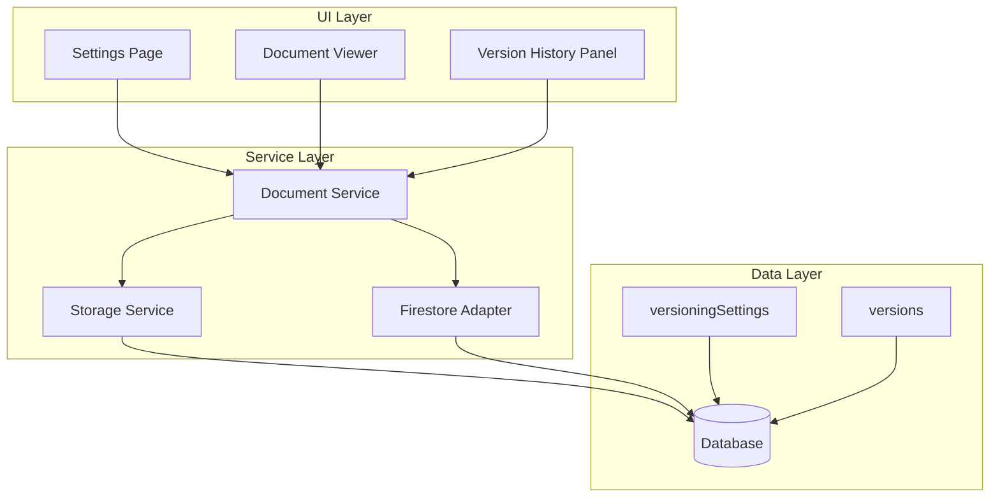

# Design Document: Document Versioning Settings

## Overview

This feature adds comprehensive versioning settings configuration to the Magra Automation system, a government tender management system with document versioning functionality. The system currently saves previous content before regenerating documents, but lacks configurable versioning behavior. This enhancement will add a settings panel to control versioning behavior, including enabling/disabling versioning, limiting the number of versions per document, configuring auto-save behavior, and managing storage optimization.

### Key Objectives

1. **Configurable Versioning**: Allow users to control when and how document versions are created
2. **Storage Management**: Implement version limits and retention policies to manage storage costs
3. **Flexible Save Options**: Support both auto-save and manual save workflows
4. **Storage Optimization**: Implement diff encoding and compression to reduce storage usage
5. **Efficient Loading**: Implement lazy loading and pagination for version history
6. **Backward Compatibility**: Ensure existing documents and workflows continue to work

### Scope

- New fields: `versioningSettings` in Settings type
- Modified services: `documentService`, `storageService`, `firestoreAdapter`
- Modified components: settings page, document viewer
- New functionality: version limit enforcement, version retention cleanup, diff encoding

## Architecture

### System Architecture



### Component Relationships

1. **Settings Page**: Displays and manages versioning settings with form controls
2. **Document Viewer**: Shows document with version history and manual save button
3. **Version History Panel**: Displays version list with lazy loading and pagination
4. **Document Service**: Main service that checks settings and creates/manages versions
5. **Storage Service**: Handles Local Storage persistence for settings and versions
6. **Firestore Adapter**: Handles Firestore persistence for settings and versions

## Components and Interfaces

### Versioning Settings Interface

```typescript
interface VersioningSettings {
  enabled: boolean;
  maxVersions: number;
  autoSaveEnabled: boolean;
  autoSaveInterval: number;  // minutes
  changeNotesRequired: boolean;
  versionRetentionDays: number;
  enableVersionComparison: boolean;
}
```

**Fields:**
- `enabled`: Boolean - Toggle to enable/disable versioning completely
- `maxVersions`: Number - Maximum number of versions to keep per document (default: 50)
- `autoSaveEnabled`: Boolean - Enable/disable auto-save on content changes (default: true)
- `autoSaveInterval`: Number - Minutes between auto-saves (default: 5)
- `changeNotesRequired`: Boolean - Require change notes before creating versions (default: false)
- `versionRetentionDays`: Number - Days before auto-deleting old versions (default: 365)
- `enableVersionComparison`: Boolean - Enable version comparison/diff feature (default: true)

### Settings Type Extension

```typescript
interface Settings extends BaseEntity {
  organizationName: string;
  departmentAddress: string;
  contactPerson: string;
  email: string;
  phone: string;
  defaultLanguage: Language;
  headerSafeZonePx: number;
  tenderNumberPrefix: string;
  versioningSettings: VersioningSettings;  // NEW
}
```

### Modified Services

#### documentService.ts (Extended)

**New Functions:**

**Version Creation with Settings Check:**
```typescript
async function createVersionWithSettings(
  documentId: string,
  contentHTML: string,
  changeNote?: string
): Promise<number | null>
```
- Reads current versioning settings
- Returns `null` if versioning is disabled
- Enforces maxVersions limit before creating new version
- Enforces versionRetentionDays cleanup
- Returns version number if successful

**Version Cleanup:**
```typescript
async function cleanupOldVersions(
  documentId: string,
  maxVersions: number,
  versionRetentionDays: number
): Promise<void>
```
- Removes versions exceeding maxVersions limit
- Removes versions older than versionRetentionDays
- Preserves current document version
- Maintains version number continuity

**Auto-Save Support:**
```typescript
async function checkAndSaveAutoVersion(
  documentId: string,
  contentHTML: string,
  autoSaveEnabled: boolean,
  autoSaveInterval: number
): Promise<void>
```
- Checks if auto-save is enabled
- Schedules auto-save after autoSaveInterval minutes
- Prevents duplicate auto-saves within interval

#### storageService.ts (Updated)

**Settings Normalization:**
```typescript
function normalizeSettings(raw: Partial<Settings> | undefined): Settings {
  if (!raw) return { ...defaultSettings };
  return {
    ...defaultSettings,
    ...raw,
    defaultLanguage: toSafeLanguage(raw.defaultLanguage),
    createdAt: toSafeString(raw.createdAt, defaultSettings.createdAt),
    updatedAt: toSafeString(raw.updatedAt, nowIso()),
  };
}
```
- Ensures versioningSettings is always present
- Applies default values for new installations

#### firestoreAdapter.ts (Updated)

**Settings Normalization:**
```typescript
async getSettings(): Promise<Settings> {
  const ref = doc(this.firestore, settingsDocPath());
  const snap = await getDoc(ref);
  if (!snap.exists()) {
    // Defaults including versioningSettings
    const defaults: Settings = { ... };
    await setDoc(ref, { ...defaults, _serverUpdatedAt: serverTimestamp(), _serverCreatedAt: serverTimestamp() });
    return defaults;
  }
  return snap.data() as Settings;
}
```
- Ensures versioningSettings is always present
- Applies default values for new installations

## Data Models

### Versioning Settings (in Settings)

```typescript
interface VersioningSettings {
  enabled: boolean;
  maxVersions: number;
  autoSaveEnabled: boolean;
  autoSaveInterval: number;
  changeNotesRequired: boolean;
  versionRetentionDays: number;
  enableVersionComparison: boolean;
}
```

**Database Field:** `versioningSettings` (nested object in Settings document)

**Example:**
```json
{
  "enabled": true,
  "maxVersions": 50,
  "autoSaveEnabled": true,
  "autoSaveInterval": 5,
  "changeNotesRequired": false,
  "versionRetentionDays": 365,
  "enableVersionComparison": true
}
```

### Document Version (Existing, Enhanced)

```typescript
interface DocumentVersion extends BaseEntity {
  documentId: string;
  versionNumber: number;
  contentHTML: string;
  changeNote?: string;
  // NEW fields for optimization:
  contentDiff?: string;      // Diff from previous version (if enableVersionComparison)
  isCompressed?: boolean;    // Whether content is compressed
}
```

**Fields:**
- `contentHTML`: String - Full HTML content (or compressed content)
- `contentDiff`: String - Optional diff from previous version
- `isCompressed`: Boolean - Whether content is compressed

### Diff Algorithm

**Algorithm Approach:**
1. Use a line-based diff algorithm (similar to `diff` utility)
2. Store only changed lines with markers
3. Support round-trip: `original + diff = new`

**Example:**
```
Original:
Line 1
Line 2
Line 3

Updated:
Line 1
Line 2 modified
Line 3

Diff:
+ Line 2 modified
- Line 2
```

**Properties:**
- Idempotent: diff(diff(x, y), z) = diff(x, z) for consecutive versions
- Consistent: Same inputs always produce same output
- Reversible: original + diff = new version

## Correctness Properties

*A property is a characteristic or behavior that should hold true across all valid executions of a system-essentially, a formal statement about what the system should do. Properties serve as the bridge between human-readable specifications and machine-verifiable correctness guarantees.*

### Property 1: Settings Default Values

*For any* settings object without versioningSettings, the normalization function shall apply all default values including `enabled: true`, `maxVersions: 50`, `autoSaveEnabled: true`, `autoSaveInterval: 5`, `changeNotesRequired: false`, `versionRetentionDays: 365`, and `enableVersionComparison: true`.

**Validates: Requirements 1.1-1.8**

### Property 2: Settings Persistence

*For any* valid versioning settings object, after storing it in the database, a subsequent read shall return the exact same settings with all values preserved.

**Validates: Requirements 1.1, 4.6**

### Property 3: Version Creation Respects Enabled Flag

*For any* document and settings configuration, if `enabled` is `false`, the document service shall skip version creation and return `null` without error.

**Validates: Requirements 7.1, 7.2**

### Property 4: Version Limit Enforcement

*For any* document with versions exceeding `maxVersions`, the cleanup function shall remove the oldest versions until exactly `maxVersions` remain, preserving the current version and maintaining contiguous version numbering.

**Validates: Requirements 3.1, 3.2, 3.3, 3.5**

### Property 5: Version Number Continuity

*For any* document after version cleanup, the version numbers shall be contiguous integers starting from 1, with no gaps in the sequence.

**Validates: Requirements 3.4**

### Property 6: Version Retention Cleanup

*For any* document with versions older than `versionRetentionDays`, the cleanup function shall remove those versions while preserving versions within the retention period.

**Validates: Requirements 7.4**

### Property 7: Diff Encoding Consistency

*For any* pair of consecutive document versions, the diff algorithm shall produce a consistent diff representation, and applying that diff to the original version shall reproduce the updated version exactly.

**Validates: Requirements 5.1, 5.2, 5.5**

### Property 8: Compression Round-Trip

*For any* document version content, compressing then decompressing the content shall produce the exact original content without data loss.

**Validates: Requirements 5.3, 5.4**

### Property 9: Lazy Loading Pagination

*For any* version history with more than the display limit, the pagination function shall return the correct subset of versions for the requested page, with accurate total count.

**Validates: Requirements 6.2**

### Property 10: Settings Change Immediate Effect

*For any* settings update, the new settings shall take effect immediately for subsequent version operations without requiring system restart or manual refresh.

**Validates: Requirements 4.6**

### Property 11: Backward Compatibility Defaults

*For any* existing installation upgrading to the new version, the system shall apply default versioning settings without requiring user intervention, and all existing documents shall continue to function correctly.

**Validates: Requirements 8.1, 8.2, 8.3**

## Error Handling

### Versioning Settings Errors

1. **Invalid Input Value**: When a user enters invalid input (negative number, zero for intervals):
   - Display specific error message indicating valid range
   - Retain previous value until valid input is provided
   - Do not save invalid data to database

2. **Database Error**: When database operations fail:
   - Return error to calling service
   - Log error with context (operation, document ID, settings field)
   - Attempt to rollback or use cached value if possible

### Version Creation Errors

1. **Version Limit Exceeded**: When cleanup fails or versions exceed limit:
   - Log warning with document ID and version count
   - Attempt cleanup again with stricter limits
   - Return error if cleanup impossible

2. **Storage Full**: When storage capacity is exceeded:
   - Log critical error with storage metrics
   - Attempt aggressive cleanup (reduce retention days)
   - Return error if storage remains full

### Diff/Compression Errors

1. **Diff Algorithm Error**: When diff calculation fails:
   - Log error with document version IDs
   - Fall back to full content storage
   - Continue operation without error

2. **Compression Error**: When compression fails:
   - Log error with content size
   - Fall back to uncompressed storage
   - Continue operation without error

## Testing Strategy

### Dual Testing Approach

**Unit Tests**: Verify specific examples, edge cases, and error conditions
**Property Tests**: Verify universal properties across all inputs (when applicable)

### Property-Based Testing

The following properties will be tested using property-based testing (PBT):

1. **Settings Default Values** (Property 1)
2. **Settings Persistence** (Property 2)
3. **Version Creation Respects Enabled Flag** (Property 3)
4. **Version Limit Enforcement** (Property 4)
5. **Version Number Continuity** (Property 5)
6. **Version Retention Cleanup** (Property 6)
7. **Diff Encoding Consistency** (Property 7)
8. **Compression Round-Trip** (Property 8)
9. **Lazy Loading Pagination** (Property 9)
10. **Settings Change Immediate Effect** (Property 10)
11. **Backward Compatibility Defaults** (Property 11)

### Unit Tests

**Settings Service:**
- Test settings normalization with and without versioningSettings
- Test default value application for missing fields
- Test validation for all input fields
- Test settings update and persistence

**Version Creation:**
- Test version creation when enabled=true
- Test version creation when enabled=false (skip)
- Test version creation with maxVersions exceeded
- Test version creation with versionRetentionDays exceeded
- Test version creation with changeNotesRequired=true (valid and invalid notes)

**Diff/Compression:**
- Test diff calculation for small changes
- Test diff calculation for large changes
- Test diff calculation for identical versions
- Test compression/decompression round-trip
- Test diff application to recreate updated version

### Integration Tests

**Settings UI:**
- Test settings page displays all versioning settings
- Test toggle switch for enabled
- Test number inputs for numeric settings
- Test checkboxes for boolean settings
- Test immediate save on setting change

**Version Workflow:**
- Test end-to-end document version creation with settings
- Test version cleanup when limit exceeded
- Test version cleanup when retention period exceeded
- Test manual save button when auto-save disabled
- Test version history loading with lazy pagination

**Backend Support:**
- Test settings persistence to Local Storage
- Test settings persistence to Firestore
- Test version storage in both backends

### Test Configuration

- **Property-based tests**: Minimum 100 iterations per property
- **Unit tests**: Cover all edge cases and error conditions
- **Integration tests**: Cover all major workflows

### Tag Format for Property Tests

Each property-based test shall be tagged with:
```
Feature: document-versioning-settings, Property {number}: {property_text}
```

## Implementation Plan

### Phase 1: Core Data Model (Week 1)

1. Update Settings type with versioningSettings field
2. Update database schema for versioningSettings
3. Update settings normalization in storageService and firestoreAdapter
4. Add default values for versioning settings

### Phase 2: Document Service Extensions (Week 2)

1. Implement version creation with settings check
2. Implement version limit enforcement and cleanup
3. Implement version retention cleanup
4. Implement change notes validation

### Phase 3: Storage Optimization (Week 3)

1. Implement diff algorithm for version comparison
2. Implement compression for old versions
3. Update DocumentVersion type to support diff and compression
4. Implement decompression function

### Phase 4: Lazy Loading (Week 4)

1. Implement version metadata loading
2. Implement pagination for version history
3. Implement lazy content loading
4. Implement content caching

### Phase 5: UI Components (Week 5)

1. Add Versioning Settings tab to settings page
2. Add form controls for all settings
3. Add manual save button to document viewer
4. Add version history panel with lazy loading

### Phase 6: Testing (Week 6)

1. Write property-based tests for all properties
2. Write unit tests for edge cases
3. Write integration tests for end-to-end workflows
4. Test backward compatibility

### Phase 7: Documentation and Deployment (Week 7)

1. Update user documentation
2. Create migration guide for existing installations
3. Deploy to staging environment
4. Deploy to production

## Migration Strategy

### Existing Data Migration

1. **Settings**: No migration needed - default values applied on first read
2. **Versions**: No migration needed - existing versions work with new settings

### Backward Compatibility

1. All existing documents will continue to work with default settings
2. Documents generated before enhancement will have versions created based on new settings
3. No changes required to existing tender creation workflows
4. Settings will be populated with defaults on first access

## Future Enhancements

1. **Version Comparison UI**: Display visual diff of document versions
2. **Bulk Version Operations**: Delete multiple versions at once
3. **Version Export**: Export specific versions as separate documents
4. **Automated Version Naming**: Auto-generate descriptive version names
5. **Version Analytics**: Track version creation patterns and storage usage
