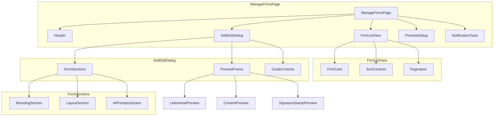
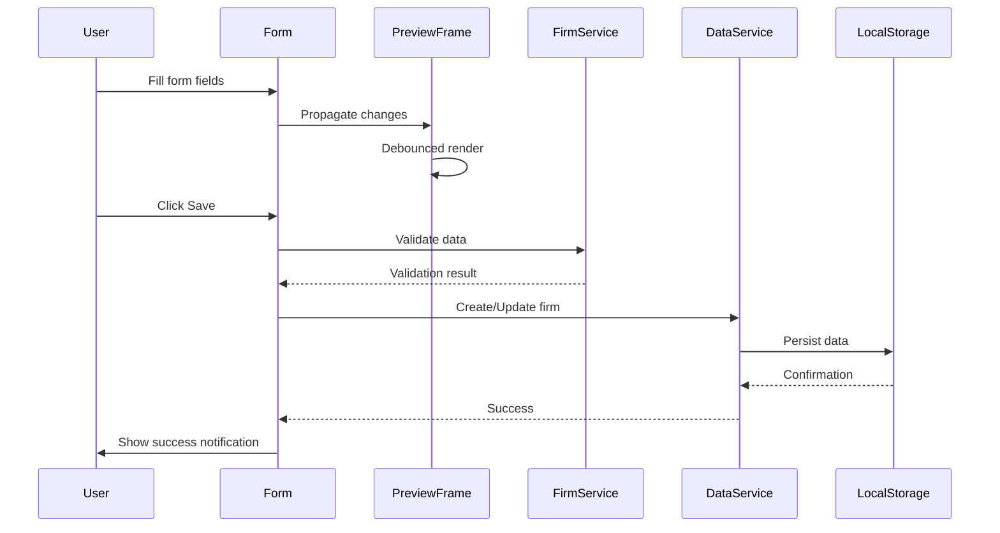

# Design Document: Manage Firms UI/UX Refactor

## Overview

This document outlines the design for refactoring the Manage Firms page in the Magra Tender Automation Platform. The current implementation provides firm management functionality but has several usability issues includingPoor form organization, limited preview capabilities, inconsistent error handling, and lack of accessibility features. This refactoring will modernize the interface while maintaining all existing functionality.

### Goals

1. Enhance the firm list view with thumbnails, sorting, and pagination
2. Improve form layout with logical sectioning and better visual feedback
3. Strengthen preview functionality with real-time updates and guide controls
4. Add style duplication feature for copying layout settings between firms
5. Implement robust error handling with clear user feedback
6. Ensure responsive design across all device sizes
7. Improve accessibility for keyboard navigation and screen readers
8. Optimize performance for large firm lists

### Scope

The refactoring covers:
- **Manage Firms Page** (`app/manage-firms/page.tsx`)
- **Form Components** (Add/Edit dialog with all form fields)
- **Preview Components** (Real-time preview frame, full preview dialog)
- **List View** (Firm cards with thumbnails, sorting, pagination)
- **State Management** (Form state, dialog state, notification state)

### Out of Scope

- Backend API changes (localStorage-only persistence remains)
- Authentication or authorization changes
- Other pages or features in the application

---

## Architecture

### Component Architecture



### Data Flow



### State Management

The page uses React's built-in state management with the following state slices:

| State Slice | Type | Purpose |
|-------------|------|---------|
| `firms` | `Firm[]` | List of all firms from localStorage |
| `loading` | `boolean` | Initial data loading state |
| `saving` | `boolean` | Save operation in progress |
| `error` | `string` | Current error message |
| `success` | `string` | Current success message |
| `dialogOpen` | `boolean` | Add/Edit dialog visibility |
| `previewOpen` | `boolean` | Preview dialog visibility |
| `editingFirm` | `Firm \| null` | Firm being edited (null = create mode) |
| `formData` | `FirmFormData` | Current form field values |
| `styleSourceId` | `string` | Selected style source firm |
| `previewSettings` | `PreviewSettings` | Guide visibility toggles |

---

## Components and Interfaces

### Core Components

#### 1. ManageFirmsPage (Container)

The main page component that orchestrates all sub-components and state.

**Responsibilities:**
- Load and manage firm data from localStorage
- Coordinate dialog open/close state
- Handle CRUD operations through dataService
- Display notifications

**Props:** None (uses internal state)

#### 2. FirmListView

Displays the paginated, sortable list of firm cards.

**Responsibilities:**
- Render firm cards in a grid layout
- Handle sorting by name, language, style profile
- Implement pagination (10 firms per page)
- Show empty state when no firms exist

**Props:**
```typescript
interface FirmListViewProps {
  firms: Firm[];
  onEdit: (firm: Firm) => void;
  onDelete: (firm: Firm) => void;
  onDuplicate: (firm: Firm) => void;
  onPreview: (firm: Firm) => void;
}
```

#### 3. FirmCard

Individual firm display card with thumbnail preview.

**Responsibilities:**
- Display firm name, language, style profile
- Show letterhead thumbnail or placeholder
- Render action buttons (Edit, Delete, Duplicate, Preview)

**Props:**
```typescript
interface FirmCardProps {
  firm: Firm;
  onEdit: () => void;
  onDelete: () => void;
  onDuplicate: () => void;
  onPreview: () => void;
}
```

#### 4. AddEditDialog

Modal dialog for creating and editing firms.

**Responsibilities:**
- Switch between create and edit modes
- Organize form into logical sections
- Provide real-time preview
- Validate before saving

**Props:**
```typescript
interface AddEditDialogProps {
  open: boolean;
  onOpenChange: (open: boolean) => void;
  editingFirm: Firm | null;
  firms: Firm[];
  onSave: (data: FirmFormData) => Promise<void>;
}
```

#### 5. FormSection

Reusable section container with heading and content area.

**Responsibilities:**
- Render section header
- Contain related form fields
- Provide consistent styling

**Props:**
```typescript
interface FormSectionProps {
  title: string;
  description?: string;
  children: React.ReactNode;
}
```

#### 6. PreviewFrame

Real-time preview component within the Add/Edit dialog.

**Responsibilities:**
- Render letterhead preview
- Display guide overlays (safe zone, boundary, bleed)
- Update in real-time as form fields change
- Show current snapped values

**Props:**
```typescript
interface PreviewFrameProps {
  formData: FirmFormData;
  showLetterheadBackground: boolean;
  showSafeZoneGuide: boolean;
  showBoundaryGuide: boolean;
  showPrintBleedGuide: boolean;
}
```

#### 7. PreviewDialog

Full-size preview dialog for detailed letterhead inspection.

**Props:**
```typescript
interface PreviewDialogProps {
  open: boolean;
  onOpenChange: (open: boolean) => void;
  firmName: string;
  html: string;
}
```

#### 8. NotificationToast

User feedback notification component.

**Props:**
```typescript
interface NotificationToastProps {
  type: 'success' | 'error';
  message: string;
  onDismiss: () => void;
}
```

### Interface Definitions

#### FirmFormData

```typescript
type FirmFormData = Omit<Firm, 'id' | 'createdAt' | 'updatedAt'>;
```

#### PreviewSettings

```typescript
interface PreviewSettings {
  showLetterheadBackground: boolean;
  showSafeZoneGuide: boolean;
  showBoundaryGuide: boolean;
  showPrintBleedGuide: boolean;
}
```

#### SortConfig

```typescript
interface SortConfig {
  field: 'name' | 'defaultLanguage' | 'firmStyleProfile';
  direction: 'asc' | 'desc';
}
```

#### PaginationConfig

```typescript
interface PaginationConfig {
  currentPage: number;
  pageSize: number;
  totalItems: number;
}
```

---

## Data Models

### Existing Types (from types/index.ts)

The feature uses existing types defined in the codebase:

```typescript
type Firm = {
  id: string;
  name: string;
  headerImagePath: string;
  signatureImagePath?: string;
  stampImagePath?: string;
  defaultLanguage: 'hindi' | 'english';
  fitLetterheadMode: 'contain' | 'cover' | 'stretch';
  contentStartY: number;
  pagePaddingLeft: number;
  aiPromptQuotation: string;
  aiPromptSupplyOrder: string;
  aiPromptVigyapti: string;
  aiPromptBill?: string;
  enableAIPromptForBill?: boolean;
  firmStyleProfile: 'govt_formal' | 'minimal_business' | 'bilingual' | 'table_heavy';
  createdAt: string;
  updatedAt: string;
};
```

### New Types for Refactoring

#### SortableFields

```typescript
type SortableField = 'name' | 'defaultLanguage' | 'firmStyleProfile';
```

#### Notification

```typescript
interface Notification {
  id: string;
  type: 'success' | 'error' | 'info';
  message: string;
  duration?: number; // ms, default 2000
  dismissible: boolean;
}
```

#### ValidationError

```typescript
interface ValidationError {
  field: string;
  message: string;
}
```

#### ValidationResult

```typescript
interface ValidationResult {
  valid: boolean;
  errors: ValidationError[];
}
```

---

---

## Error Handling

### Validation Errors

Form validation errors are displayed inline next to the relevant field:

| Field | Validation Rule | Error Message |
|-------|-----------------|---------------|
| `name` | Required, non-empty | "Firm name is required" |
| `headerImagePath` | Required, non-empty | "Letterhead image is required" |
| `contentStartY` | Must be >= 80 and <= 320 | "Content start must be between 80px and 320px" |
| `pagePaddingLeft` | Must be >= 0 and <= 100 | "Padding must be between 0px and 100px" |

### File Upload Errors

| Error Condition | User Message | Recovery Action |
|-----------------|--------------|-----------------|
| File too large (>5MB) | "File is too large. Maximum size is 5MB." | Re-upload with smaller file |
| Invalid file type | "Invalid file type. Please upload an image file." | Re-upload with valid type |
| Read error | "Failed to read file. Please try again." | Re-upload the file |
| Storage full | "Storage is full. Please delete some firms to free up space." | Delete existing firms |

### Network/Storage Errors

| Error Condition | User Message | Recovery Action |
|-----------------|--------------|-----------------|
| localStorage unavailable | "Storage is not available. Please enable cookies and storage." | None (blocking) |
| Storage quota exceeded | "Storage limit reached. Please export backup and delete some data." | Export backup |
| Corrupted data | "Data appears corrupted. Please restore from backup." | Import backup |

### Deletion Confirmation

Before deleting a firm, a confirmation dialog is displayed:

```
Delete Firm?
Are you sure you want to delete "{firmName}"? This action cannot be undone.

[Cancel] [Delete]
```

### Unexpected Errors

For unhandled exceptions:
- Log error to console with stack trace
- Display user-friendly message: "An unexpected error occurred. Please try again."
- Do not expose internal error details to user

---

## Testing Strategy

### Testing Approach

This feature uses a **dual testing approach** combining unit tests for specific examples and integration tests for user flows.

### Unit Tests

Unit tests focus on specific behaviors and edge cases:

1. **Form Validation Tests**
   - Valid firm data passes validation
   - Empty name triggers error
   - Missing letterhead triggers error
   - Invalid numeric ranges trigger errors

2. **Image Upload Tests**
   - Valid image files are accepted
   - Invalid file types are rejected with error message
   - Large files show warning

3. **Sorting Tests**
   - Firms sorted by name (ascending/descending)
   - Firms sorted by language
   - Firms sorted by style profile

4. **Pagination Tests**
   - First page shows first 10 firms
   - Subsequent pages show correct offset
   - Empty page shows empty state

### Integration Tests

Integration tests verify complete user flows:

1. **Create Firm Flow**
   - Open dialog → Fill form → Upload image → Save → Verify in list

2. **Edit Firm Flow**
   - Click edit → Modify fields → Save → Verify changes

3. **Delete Firm Flow**
   - Click delete → Confirm → Verify removed from list

4. **Style Duplication Flow**
   - Select source firm → Click duplicate → Verify settings copied

5. **Preview Flow**
   - Open preview dialog → Verify full rendering → Close → Clean up

### Accessibility Testing

1. **Keyboard Navigation**
   - All interactive elements reachable via Tab
   - Dialog focus trapped within modal
   - Escape key closes dialogs

2. **Screen Reader Support**
   - Form labels associated with inputs
   - Error messages announced
   - Dialog titles announced on open

### Test Implementation

```typescript
// Example test structure
describe('ManageFirmsPage', () => {
  describe('Form Validation', () => {
    it('should show error when firm name is empty');
    it('should show error when letterhead is missing');
    it('should validate contentStartY range');
  });

  describe('Firm List', () => {
    it('should display firm cards with thumbnails');
    it('should sort firms by name');
    it('should paginate after 10 firms');
  });

  describe('User Flows', () => {
    it('should create new firm with all fields');
    it('should update existing firm');
    it('should delete firm with confirmation');
  });
});
```

### Test Configuration

- Use React Testing Library for component tests
- Mock localStorage for isolation
- Mock file uploads for consistent testing
- Minimum coverage target: 80% of components

---

## Implementation Notes

### Performance Considerations

1. **Preview Debouncing** - Preview updates should be debounced (200ms) to prevent excessive re-renders
2. **Image Optimization** - Convert uploaded images to optimized data URLs before storage
3. **List Virtualization** - Consider virtualization for very large firm lists (>100)
4. **Pagination** - Always paginate the firm list (10 per page)

### Accessibility Requirements

1. Use semantic HTML (section, article, nav)
2. Ensure all images have alt text
3. Use ARIA attributes for custom components
4. Support keyboard-only navigation
5. Meet WCAG 2.1 AA standards

### Responsive Breakpoints

| Breakpoint | Layout |
|------------|--------|
| < 768px | Single column, stacked form/preview |
| 768px - 1023px | Two column, compact preview |
| >= 1024px | Side-by-side form and preview |

### Design Decisions

1. **Dialog Size** - Use `max-w-7xl` for Add/Edit dialog to accommodate side-by-side layout
2. **Preview Aspect Ratio** - Maintain A4 aspect ratio (1:1.414) in preview frame
3. **Notification Duration** - Success: 2 seconds, Error: manual dismiss
4. **Default Page Size** - 10 firms per page for optimal readability
5. **Sort Defaults** - Default sort: name, ascending