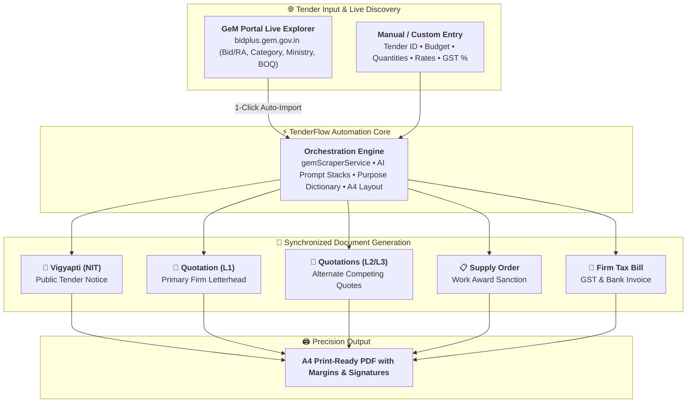
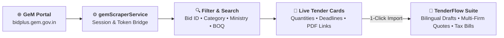
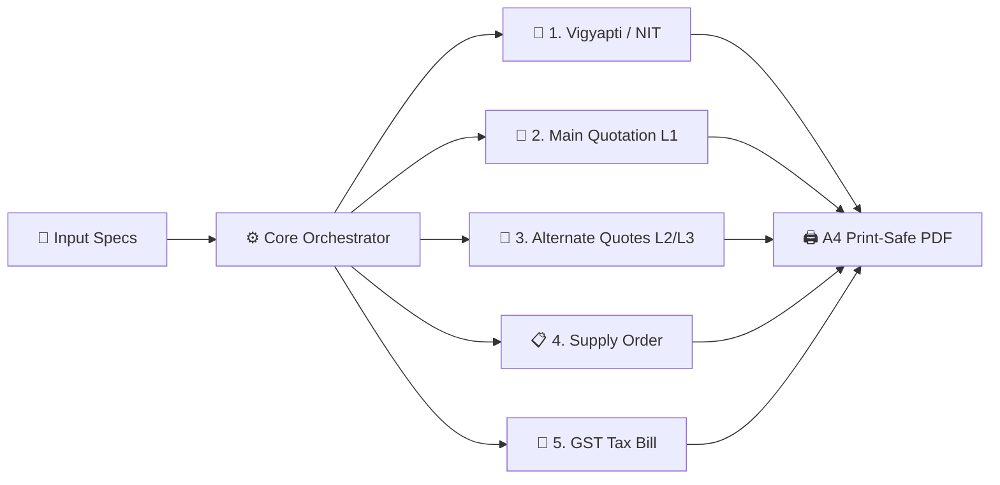
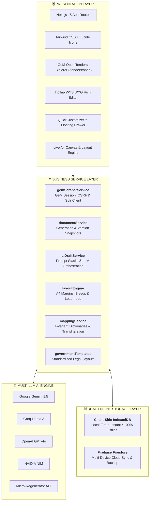
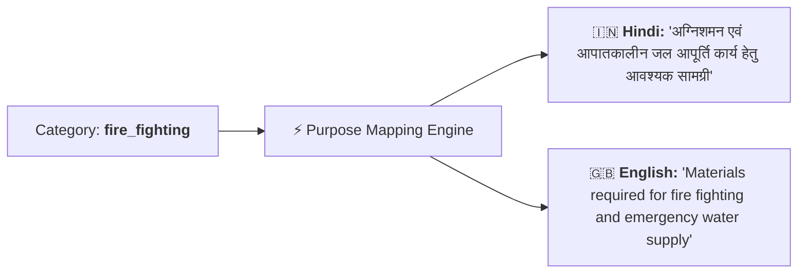
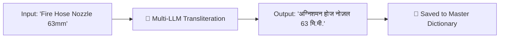
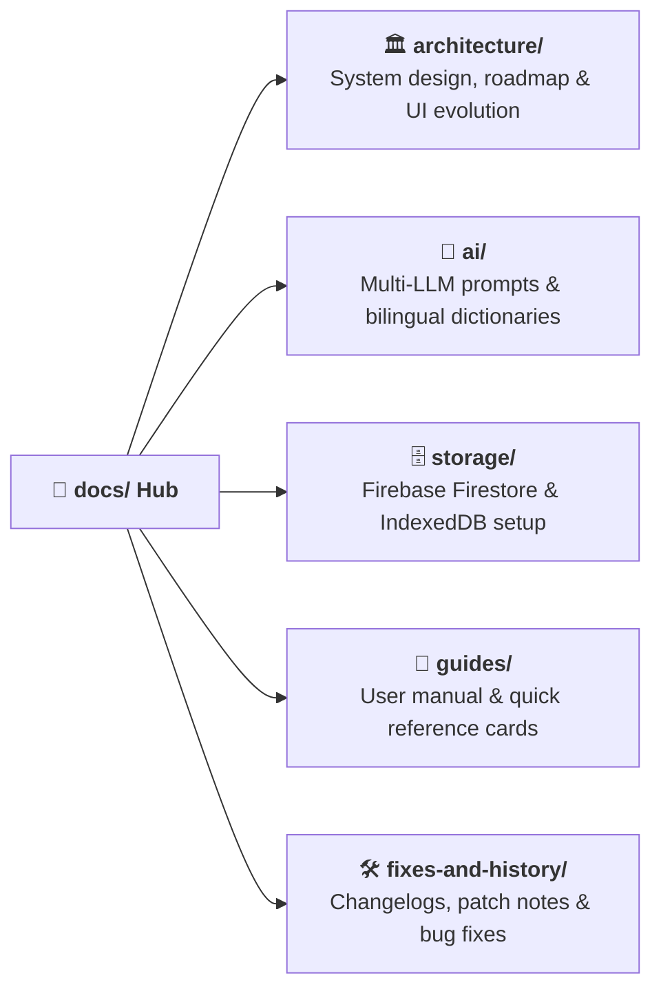

<div align="center">

# ⚡ TENDERFLOW AI
### *Next-Gen Autonomous Government Tender & Procurement Automation Suite*

[](https://nextjs.org/)
[](https://www.typescriptlang.org/)
[](https://tailwindcss.com/)
[](https://ai.google.dev/)
[](https://groq.com/)
[](https://openai.com/)
[](https://firebase.google.com/)
[](https://web.dev/progressive-web-apps/)

<br />

<p align="center">
  <b>Transform 4 hours of tedious government tender paperwork into a 60-second automated workflow.</b><br />
  Live GeM Tender Explorer & 1-Click Import • Multi-Document Generation • Firm Letterhead Engine • Bilingual Hindi-English Transliteration • AI Procurement Drafting • Print-Ready A4 PDF Engine • 100% Offline-First (IndexedDB) + Cloud Sync (Firestore)
</p>

<p align="center">
  <a href="#-key-features">Key Features</a> •
  <a href="#-system-workflow">System Workflow</a> •
  <a href="#-gem-tender-explorer">GeM Explorer</a> •
  <a href="#-document-pipeline">Document Pipeline</a> •
  <a href="#-architecture--tech-stack">Architecture</a> •
  <a href="#-bilingual--ai-intelligence">AI Engine</a> •
  <a href="#-quickstart-guide">Quickstart</a> •
  <a href="docs/README.md">Documentation Hub</a>
</p>


</div>

---

## 🌟 Executive Overview

**TenderFlow AI** is an enterprise-grade procurement automation platform engineered specifically for government contractors, vendors, and administrative departments.

Whether importing live published bids from India's official **GeM (Government e-Marketplace)** portal or entering custom tender specifications, TenderFlow instantly orchestrates, drafts, and renders an entire synchronized package of official documents — complete with firm-specific letterheads, custom legal conditions, localized Hindi transliterations, dynamic GST calculations, and pixel-perfect A4 print-ready layouts.

---

## 🔄 System Workflow



---

## 🚀 Key Features

<table>
  <tr>
    <td width="50%" valign="top">
      <h3>🌐 GeM Live Tender Explorer & Auto-Import</h3>
      <ul>
        <li>Live real-time discovery of active tenders directly from India's official <b>GeM Portal (bidplus.gem.gov.in)</b>.</li>
        <li>Multi-vector search: Bid/RA Number, Category, Ministry, State/City, and BOQ budget ranges.</li>
        <li><b>1-Click Import:</b> Auto-populates line items, quantities, and deadlines into the tender drafting suite.</li>
      </ul>
    </td>
    <td width="50%" valign="top">
      <h3>🏛️ 1-Click Multi-Document Generation</h3>
      <ul>
        <li>Generate <b>Vigyapti</b>, <b>Quotations (Main & Alternate Rates)</b>, <b>Supply Orders</b>, and <b>Firm Bills</b> in one synchronized step.</li>
        <li>Eliminates duplicate manual entries, mismatched dates, and calculation mistakes.</li>
        <li>Instant document versioning snapshot engine with rollback support.</li>
      </ul>
    </td>
  </tr>
  <tr>
    <td width="50%" valign="top">
      <h3>⚡ QuickCustomizer™ Floating Drawer</h3>
      <ul>
        <li>Interactive floating side-drawer for live in-document customizations.</li>
        <li><b>1-Click Clause Injection:</b> Strict Govt Tone, 1-Yr Warranty, 7-Day Urgent Delivery, 30-Day Inspection Payment & ISO Standards.</li>
        <li><b>Per-Clause AI Micro-Regenerator:</b> Inline rephrasing with custom prompt instructions.</li>
      </ul>
    </td>
    <td width="50%" valign="top">
      <h3>🔍 Smart Product Autocomplete Portal</h3>
      <ul>
        <li>High-performance floating portal autocomplete for rapid item entry.</li>
        <li>Instant search across English, Hindi, and Raw vendor catalog names.</li>
        <li>Auto-fills product descriptions, units, rates, and GST tax slabs with 1-click.</li>
      </ul>
    </td>
  </tr>
  <tr>
    <td width="50%" valign="top">
      <h3>🎨 Precision A4 Letterhead Engine</h3>
      <ul>
        <li>Dynamic background letterhead integration with <code>contain</code>, <code>cover</code>, and <code>stretch</code> fit modes.</li>
        <li>Print-safe margin boundaries, live safe-zone guides, and overflow detection.</li>
        <li>Drag-and-drop firm digital signatures and official seals.</li>
      </ul>
    </td>
    <td width="50%" valign="top">
      <h3>🤖 Multi-LLM Bilingual Intelligence</h3>
      <ul>
        <li>Native support for <b>Google Gemini</b>, <b>Groq (Llama 3)</b>, <b>NVIDIA NIM</b>, and <b>OpenAI</b>.</li>
        <li>Domain-tuned for formal Hindi government procurement terminology.</li>
        <li>Automated English-to-Hindi item catalog transliteration cache.</li>
      </ul>
    </td>
  </tr>
  <tr>
    <td width="50%" valign="top" colspan="2">
      <h3>⚡ Local-First + Cloud-Ready Hybrid Architecture</h3>
      <ul>
        <li><b>100% Offline Capable:</b> Instant client-side IndexedDB database.</li>
        <li><b>Cloud Sync:</b> Real-time Firestore synchronization with namespace isolation.</li>
        <li>PWA support with service worker asset caching.</li>
      </ul>
    </td>
  </tr>
</table>

---

## 🌐 GeM Open Tender Explorer

Search, filter, and import active government bids in real time without leaving TenderFlow:



* **Live Bid PDF & Corrigendum Links**: Directly access official bid documents and corrigendum addendums.
* **Auto-Populate Specs**: Imports product specifications, quantities, and submission dates instantly.
* 👉 **[Read Detailed GeM Explorer Documentation ➔](docs/guides/GEM_TENDER_EXPLORER.md)**

---

## 📋 Document Pipeline



| Document Type | Official Hindi Title | Letterhead Applied? | Description |
| :--- | :--- | :---: | :--- |
| **`vigyapti`** | निविदा सूचना (NIT) | ❌ Plain (Public) | Official public procurement notice detailing line items, earnest money, and deadlines |
| **`quotation_main`** | मुख्य कोटेशन (L1) | ✅ Yes (Branded) | Lowest-rate compliant bid generated on selected primary firm's letterhead |
| **`quotation_alt_1`** | वैकल्पिक कोटेशन 1 (L2) | ✅ Yes (Branded) | Alternate quotation on secondary firm's letterhead for price comparison |
| **`quotation_alt_2`** | वैकल्पिक कोटेशन 2 (L3) | ✅ Yes (Branded) | Third competitive rate quote for statutory departmental compliance |
| **`supply_aadesh`** | आपूर्ति आदेश / कार्यादेश | ✅ Yes (Branded) | Official supply award sanction letter with contractual conditions |
| **`firm_bill`** | फर्म टैक्स बिल | ✅ Yes (Branded) | Complete GST tax invoice with bank details, IFSC, and HSN breakdown |

---

## 🏛️ Architecture & Tech Stack




---

## 🧠 Bilingual & AI Intelligence

TenderFlow bridges standard English commercial terminology with formal Hindi administrative procurement standards.

### 1. Purpose Library Engine
Transforms simple categories into legally sound administrative purpose statements:



### 2. 4-Tier Alternate Translation Variations
Every line item is equipped with 4 distinct length and styling options for document customization:
* **Full Title**: Complete formal specification.
* **Alt 1 (Medium)**: Balanced, standard quotation title.
* **Alt 2 (Short)**: Concise, high-density table format.
* **Alt 3 & 4 (Combined)**: Title seamlessly combined with product description paragraphs.

### 3. Automated Transliteration Cache
English line items are automatically translated/transliterated and cached in IndexedDB for instantaneous future queries:



---

## 📂 Documentation Center

All technical documentation is organized inside the [`docs/`](docs/) directory:



| Section | Description | Link |
| :--- | :--- | :---: |
| 🏛️ **Architecture** | System topology, roadmap, before/after comparison | [Explore ➔](docs/architecture/ARCHITECTURE.md) |
| 🤖 **AI & Transliteration** | Multi-LLM configuration, prompt engineering & dictionaries | [Explore ➔](docs/ai/AI_INTEGRATION_GUIDE.md) |
| 🗄️ **Storage & Cloud** | IndexedDB offline layer & Firestore cloud sync setup | [Explore ➔](docs/storage/FIREBASE_STORAGE_SETUP.md) |
| 📖 **Guides & Manuals** | Comprehensive user manual, quick references & onboarding | [Explore ➔](docs/guides/USER_GUIDE.md) |
| 🛠️ **Fixes & Changelogs** | Implementation status, layout fixes & patch history | [Explore ➔](docs/fixes-and-history/IMPLEMENTATION_STATUS.md) |

👉 **[View Complete Documentation Directory ➔](docs/README.md)**

---

## ⚡ Quickstart Guide

### 📋 Prerequisites
* **Node.js**: `v18.17.0` or higher
* **Package Manager**: `npm`, `yarn`, `pnpm`, or `bun`

### 🛠️ Installation & Setup

1. **Clone the repository:**
   ```bash
   git clone https://github.com/your-username/tenderflow-ai.git
   cd tenderflow-ai
   ```

2. **Install dependencies:**
   ```bash
   npm install
   ```

3. **Configure Environment:**
   ```bash
   cp .env.example .env.local
   ```
   Configure your preferred AI provider and storage backend in `.env.local`:
   ```env
   # AI Provider (gemini, openai, groq, nvidia, mock)
   NEXT_PUBLIC_AI_PROVIDER=gemini
   NEXT_PUBLIC_AI_API_KEY=your_api_key_here
   NEXT_PUBLIC_AI_MODEL=gemini-1.5-flash

   # Storage Mode (indexeddb or firestore)
   NEXT_PUBLIC_DATA_BACKEND=indexeddb
   ```

4. **Launch Development Server:**
   ```bash
   npm run dev
   ```
   Navigate to [http://localhost:3000](http://localhost:3000).

---


## 🤝 Contributing

Contributions, issues, and feature requests are welcome!

1. Fork the repository
2. Create your branch (`git checkout -b feature/awesome-feature`)
3. Commit your changes (`git commit -m 'feat: Add awesome feature'`)
4. Push to the branch (`git push origin feature/awesome-feature`)
5. Open a Pull Request

---

## 📄 License

This software is distributed under proprietary licensing. See [LICENSE](LICENSE) for details.

<div align="center">
  <sub>Crafted with ❤️ by the Magraa Powered by Next.js, TypeScript & Advanced AI.</sub>
</div>

