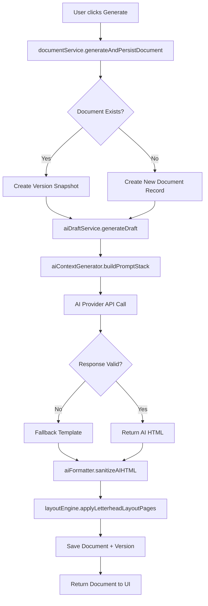
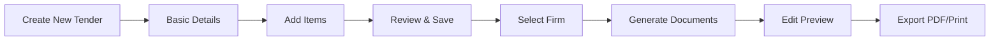

# Magra Tender Automation Panel

Professional government tender document automation system with firm-specific branding, bilingual support, AI-powered drafting, and print-ready A4 document generation.

---

## 1) What This Is

Magra Tender Automation is a comprehensive government tender management platform that eliminates repetitive work in tender document preparation. It provides:

- **One-time tender creation** - Enter tender details and items once
- **Multi-document generation** - Automatically create Vigyapti (Tender Notice), Quotation (Main/Alternate), Supply Order, and Firm Bill
- **Firm-specific branding** - Each firm has its own letterhead, style profile, and AI prompts
- **Bilingual support** - Seamless Hindi/English language switching
- **Master dictionaries** - Reusable purpose mappings and Hindi transliteration for consistent professional language
- **Document versioning** - Track all changes with version snapshots
- **A4 layout engine** - Precise letterhead positioning with print-safe guides

---

## 2) Complete Architecture

### Tech Stack

| Layer | Technology |
|-------|------------|
| **Framework** | Next.js 15 (App Router) |
| **Language** | TypeScript (strict mode) |
| **Styling** | Tailwind CSS |
| **Editor** | TipTap (WYSIWYG) |
| **Database** | IndexedDB (client-side) |
| **AI Providers** | Google Gemini, OpenAI, Groq, NVIDIA NIM |
| **PDF Rendering** | A4 layout engine + print-to-PDF |

### Service Layer Architecture

```
┌─────────────────────────────────────────────────────────────┐
│                     UI Layer (app/*)                        │
│  - Dashboard, Tender Creation, Document Preview, Editor     │
└───────────────────────┬─────────────────────────────────────┘
                        │
┌───────────────────────▼─────────────────────────────────────┐
│                   Service Layer (services/*)                │
│  ┌──────────────┐  ┌──────────────┐  ┌──────────────┐     │
│  │ dataService  │  │documentService│  │aiDraftService│     │
│  └──────────────┘  └──────────────┘  └──────────────┘     │
│  ┌──────────────┐  ┌──────────────┐  ┌──────────────┐     │
│  │layoutEngine  │  │aiFormatter   │  │mappingService│     │
│  └──────────────┘  └──────────────┘  └──────────────┘     │
└───────────────────────┬─────────────────────────────────────┘
                        │
┌───────────────────────▼─────────────────────────────────────┐
│                   Data Layer (data/*)                       │
│  ┌──────────────┐  ┌──────────────┐  ┌──────────────┐     │
│  │  db.ts       │  │schema.ts     │  │storageService│     │
│  └──────────────┘  └──────────────┘  └──────────────┘     │
└─────────────────────────────────────────────────────────────┘
```

### Service Responsibilities

| Service | Purpose |
|---------|---------|
| `dataService` | Thin CRUD interface for all data operations |
| `db.ts` | IndexedDB wrapper with automatic schema migrations |
| `documentService` | Document generation orchestration and versioning |
| `aiDraftService` | AI prompt engineering, generation, and fallback |
| `aiFormatter` | HTML sanitization and normalization |
| `layoutEngine` | A4 page composition with letterhead and guides |
| `mappingService` | Purpose mappings and Hindi transliteration management |
| `governmentTemplates` | Structured template generation for Vigyapti/Supply Aadesh |
| `aiClient` | Unified AI provider integration (Gemini, OpenAI, Groq, NVIDIA) |

---

## 3) Complete Document Generation Flow



### Detailed Flow Steps

1. **Prompt Construction** (`aiDraftService`)
   - System prompt + Style profile + Doc type + Firm instructions
   - Purpose library lookup for professional procurement language

2. **AI Generation** (`aiClient`)
   - Supports multiple providers: Gemini, OpenAI, Groq, NVIDIA
   - Falls back to mock for development
   - Returns structured HTML

3. **Template Fallback** (if AI fails)
   - `governmentTemplates.generateVigyapti()`
   - `governmentTemplates.generateSupplyAadesh()`
   - `simulateAIDraftHTML()` for basic documents

4. **Layout Composition** (`layoutEngine`)
   - Letterhead background (if doc type requires)
   - Safe zone guide
   - Page boundary guide
   - Print bleed margin
   - Signature and stamp layers

5. **Versioning** (`documentService`)
   - Saves previous content as version
   - Assigns new version number
   - Updates lastModified timestamp

---

## 4) Document Types

| Type | Letterhead | Description |
|------|------------|-------------|
| `vigyapti` | No | Public tender notice |
| `quotation_main` | Yes | Main firm quotation |
| `quotation_alt_1` | Yes | Alternate quotation A |
| `quotation_alt_2` | Yes | Alternate quotation B |
| `supply_aadesh` | Yes | Formal supply order |
| `firm_bill` | Yes | Tax bill/invoice |

### Letterhead Policy

Letterhead is automatically applied only to firm-bound documents:
- **Uses letterhead**: quotation_main, quotation_alt_1, quotation_alt_2, supply_aadesh, firm_bill
- **No letterhead**: vigyapti (public notice)

Old documents with incorrect letterhead flags are auto-corrected.

---

## 5) AI Integration

### Supported Providers

| Provider | Free Tier | Best For | API Key Required |
|----------|-----------|----------|------------------|
| **Google Gemini** | ✅ Yes | General use, Indian languages | ✅ Yes |
| **Groq** | ✅ Yes | Fast generation (Llama 3) | ✅ Yes |
| **NVIDIA NIM** | ✅ Yes | Open source models | ✅ Yes |
| **OpenAI** | ❌ No | High quality output | ✅ Yes |
| **Mock** | ✅ Yes | Development/testing | ❌ No |

### Environment Configuration

```bash
# Choose your provider
NEXT_PUBLIC_AI_PROVIDER=gemini  # gemini, openai, groq, nvidia, mock

# Get API key from your provider
NEXT_PUBLIC_AI_API_KEY=your_api_key_here

# Select model (provider-specific)
NEXT_PUBLIC_AI_MODEL=gemini-1.5-flash
```

### AI Prompt Stack

```
1. System Prompt (always same)
   "You write procurement documents in structured HTML..."

2. Style Profile (firm-specific)
   "Use strict official structure, numbered sections, formal tone."

3. Document Type
   "Generate a quotation for the main firm."

4. Firm Instructions (optional)
   [Custom AI prompt from firm settings]
```

### Purpose Library Integration

The AI generation uses procurement purpose mappings to professionalize language:

```
Category: "fire_fighting"
↓
Purpose: "अग्निशमन एवं जल आपूर्ति कार्य हेतु आवश्यक सामग्री"
↓
Document: "नगर परिषद द्वारा [Purpose] क्रय किया जाना प्रस्तावित है"
```

### Hindi Transliteration

English item names are automatically transliterated to Hindi:

```
Input: "Fire Hose Nozzle"
↓
AI API Call (first time only)
↓
Output: "अग्निशमन होज नोज़ल"
↓
Saved in itemHindiMappings for reuse
```

---

## 6) Master Dictionaries

### Purpose Mappings

Category-based professional procurement purposes:

```
Category: "fire_fighting"
  → Hindi: "अग्निशमन एवं जल आपूर्ति कार्य हेतु आवश्यक सामग्री"
  → English: "Materials required for fire fighting and water supply work"

Category: "water_supply"
  → Hindi: "जल आपूर्ति एवं पाइप लाइन निर्माण कार्य हेतु आवश्यक सामग्री"
```

### Hindi Mappings

| Type | Example | Usage |
|------|---------|-------|
| **Item Hindi** | "Fire Hose Nozzle" → "अग्निशमन होज नोज़ल" | In item tables |
| **Vendor Hindi** | "M/s ABC Traders" → "एम/एस एबीसी ट्रेडर्स" | In firm details |

### Management Interface

Available in the application for:
- View all mappings
- Add new mappings
- Edit existing mappings
- Bulk import/export (JSON)

---

## 7) Firm Management

### Configuration Fields

| Field | Purpose |
|-------|---------|
| **Letterhead Upload** | Firm branding background image |
| **Signature Upload** | Digital signature (optional) |
| **Stamp Upload** | Digital stamp (optional) |
| **Fit Mode** | `contain`, `cover`, or `stretch` for letterhead |
| **Header Spacing** | Distance from top for content (px) |
| **Footer Spacing** | Reserved space at bottom (px) |
| **Page Margin** | Left/right margins (px) |
| **Style Profile** | `govt_formal`, `minimal_business`, `bilingual`, `table_heavy` |
| **Default Language** | Hindi or English |
| **AI Prompts** | Custom instructions for each document type |
| **Firm Details** | Address, GST, mobile, contact person |
| **Bank Details** | Account, IFSC, branch for bill generation |

### Live A4 Preview

Real-time preview with:
- Letterhead background
- Safe zone guide (orange dashed)
- Page boundary (dashed)
- Print bleed margin (dotted)
- Signature/stamp positioning

---

## 8) Tender Creation Flow



### Steps

1. **Basic Details**
   - Tender title and number
   - Department profile
   - Main and alternate firms
   - Language preference
   - Place and district

2. **Add Items**
   - Product name, description
   - Quantity and rate
   - GST percentage (0, 5, 9, 12, 18)
   - Estimated amount (for Vigyapti)
   - Category assignment (for purpose mapping)

3. **Generate Documents**
   - Select document types
   - Choose language
   - Adjust letterhead toggles
   - Preview output

4. **Edit & Export**
   - Rich text editor for content refinement
   - Toggle letterhead, guides, signature, stamp
   - Print directly or export to PDF

---

## 9) Data Model

### Main Entities

```typescript
interface Tender {
  id, createdAt, updatedAt
  title, tenderNumber, departmentProfileId
  mainFirmId, alternateFirms: string[]
  items: TenderItem[]
  language, status: 'draft' | 'final'
  placeName, districtName
  publishDate, submissionDate, openingDate
  estimatedBudget, estimatedAmount
}

interface Firm {
  id, createdAt, updatedAt
  name, headerImagePath
  signatureImagePath?, stampImagePath?
  defaultLanguage, fitLetterheadMode
  headerSpacing, footerSpacing, pageMargin
  firmStyleProfile: 'govt_formal' | 'minimal_business' | 'bilingual' | 'table_heavy'
  aiPromptQuotation, aiPromptBill?
  firmCity, firmAddress, gstNumber
  mobileNumber, contactPerson
  bankName, bankBranch, ifscCode, accountNumber
  panNumber, billInstructions
}

interface TenderItem {
  id, createdAt, updatedAt
  tenderId, productName, description
  category, quantity, unit, rate
  gstPercent: 0 | 5 | 9 | 12 | 18
  estimatedAmount?, totalAmount
}

interface TenderDocument {
  id, createdAt, updatedAt
  tenderId, docType
  contentHTML, pdfPath
  currentVersion, versions: DocumentVersion[]
  showLetterheadBackground, showSafeMarginGuide
  lockHeaderPosition, includeSignature, includeStamp
  footerNotes, overflowWarning
}

interface PurposeMapping {
  id, createdAt, updatedAt
  category, professionalPurpose, language
  usageCount, isAutoGenerated
}

interface HindiMapping {
  id, createdAt, updatedAt
  englishName, hindiName, type: 'item' | 'vendor'
  usageCount, isAutoGenerated
}
```

---

## 10) Setup and Run

### Prerequisites

- Node.js 18+ 
- npm or yarn

### Installation

```bash
# Clone the repository
git clone <repository-url>
cd "e:\Magra Automation"

# Install dependencies
npm install

# Configure environment
cp .env.example .env
# Edit .env with your settings

# Run development server
npm run dev
```

### Production Build

```bash
# Type checking
npm run type-check

# Build production bundle
npm run build

# Start production server
npm start
```

### Open Application

```
http://localhost:3000/dashboard
```

---

## 11) Data Storage

### Default Backend (Client-Side)

- **Storage**: IndexedDB
- **Key**: `tender-automation-db`
- **Persistence**: Browser-local (survives refresh)
- **Offline**: Fully offline capable

### Cloud Backend (Optional - Firebase)

Set environment variables:

```bash
NEXT_PUBLIC_DATA_BACKEND=firestore
NEXT_PUBLIC_FIREBASE_API_KEY=your_api_key
NEXT_PUBLIC_FIREBASE_AUTH_DOMAIN=your_project.firebaseapp.com
NEXT_PUBLIC_FIREBASE_PROJECT_ID=your_project_id
NEXT_PUBLIC_FIREBASE_APP_ID=your_app_id
```

Firestore collections: `tap/<namespace>/tenders`, `tap/<namespace>/firms`, etc.

---

## 12) Key Features

### ✅ Implemented

- Local-first data storage with IndexedDB
- Multi-firm support with individual branding
- Letterhead fit modes: contain, cover, stretch
- Fixed GST slabs: 0, 5, 9, 12, 18
- Document versioning with snapshots
- A4 layout engine with print-safe guides
- Bilingual support (Hindi/English)
- AI-powered document generation
- Purpose library for professional language
- Hindi transliteration for items and vendors
- Master dictionaries management
- Document layout duplication across documents
- Export to PDF via print dialog
- Backup/restore functionality

### 🚧 In Progress

- Production-grade PDF engine (Puppeteer)
- Firebase/Supabase cloud sync
- Multi-user collaboration

### 📋 Planned

- Digital signature workflows
- Tender package export (zip bundle)
- Document diff and version comparison
- Approval workflows (Draft → Review → Final)
- Audit logs and activity timeline

---

## 13) Project Structure

```
e:\Magra Automation
├── app/                          # Next.js App Router pages
│   ├── dashboard/               # Tender list and overview
│   ├── tenders/                 # Tender creation and management
│   │   ├── new/                # New tender form
│   │   └── [id]/               # Tender documents and editor
│   ├── manage-firms/           # Firm branding configuration
│   ├── settings/               # System settings
│   ├── api/                    # API routes
│   │   └── pdf/               # PDF generation endpoints
│   ├── layout.tsx              # Root layout
│   ├── page.tsx                # Landing page
│   └── providers.tsx           # React context providers
├── components/                  # React components
│   ├── forms/                  # Form components
│   │   ├── createTenderForm.tsx
│   │   └── professionalTenderForm.tsx
│   ├── editors/                # Rich text editor
│   │   └── richTextEditor.tsx
│   ├── ui/                     # shadcn/ui components
│   └── documentViewer.tsx      # Document preview
├── services/                   # Business logic layer
│   ├── dataService.ts          # Data CRUD interface
│   ├── db.ts                   # IndexedDB wrapper
│   ├── documentService.ts      # Document orchestration
│   ├── aiDraftService.ts       # AI generation
│   ├── aiFormatter.ts          # HTML sanitization
│   ├── layoutEngine.ts         # A4 layout
│   ├── mappingService.ts       # Purpose & Hindi mappings
│   ├── governmentTemplates.ts  # Template generation
│   ├── aiClient.ts             # AI provider integration
│   └── firmService.ts          # Firm operations
├── types/                      # TypeScript types
├── data/                       # Schema definitions
├── public/                     # Static assets
├── .env.example                # Environment template
└── package.json
```

---

## 14) Developer Guide

### Adding a New Feature

1. **Extend types/index.ts** - Define new data structures
2. **Update db.ts** - Add database operations
3. **Extend dataService.ts** - Add CRUD interface
4. **Add business logic** - Services layer
5. **Update UI components** - Frontend integration

### Key Rules

- ❌ Don't hardcode layout in components → use `layoutEngine`
- ✅ Keep UI dumb → consume services only
- ✅ All layout rules in `layoutEngine.ts`
- ✅ Business logic in service layer
- ✅ Verify: `npm run type-check` and `npm run build`

### Useful Commands

```bash
# Type checking
npm run type-check

# Build
npm run build

# Development server
npm run dev

# Test (if implemented)
npm test
```

---

## 15) API Endpoints

### PDF Generation

```
POST /api/pdf/generate
Content-Type: application/json

{
  "documentId": "uuid",
  "firmId": "uuid",
  "language": "hindi"
}

Response: { pdfPath: "https://..." }
```

---

## 16) Contributing

1. Fork the repository
2. Create feature branch (`git checkout -b feature/amazing-feature`)
3. Commit changes (`git commit -m 'Add amazing feature'`)
4. Push to branch (`git push origin feature/amazing-feature`)
5. Open Pull Request

---

## 17) License

This project is proprietary to Magra Automation.

---

## 18) Contact

For support or inquiries, contact the development team.

---

**Built with Next.js, TypeScript, and AI.**
