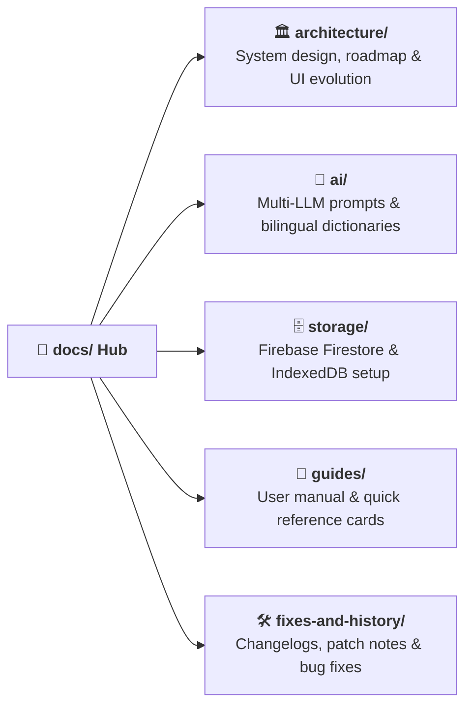

# 📚 Project Documentation Hub

Welcome to the comprehensive documentation hub. Here you'll find architectural designs, AI prompt engineering guides, storage configurations, user onboarding manuals, and troubleshooting logs.

---

## 📂 Documentation Directory

---

## 📑 Detailed Index

### 🏛️ Architecture & System Design
| Document | Description |
| :--- | :--- |
| [Architecture Overview](architecture/ARCHITECTURE.md) | High-level system topology, service layers, and state flow |
| [Roadmap](architecture/ROADMAP.md) | Feature timeline, upcoming releases, and future vision |
| [Project Overview](architecture/overview.md) | Executive summary and core value propositions |
| [UI Redesign Implementation](architecture/REDESIGN_IMPLEMENTATION.md) | Details on UI/UX modernization and component refactoring |
| [Before vs After Comparison](architecture/BEFORE_AFTER_COMPARISON.md) | Performance, UI, and feature comparison breakdown |

---

### 🤖 AI Engine & Bilingual Processing
| Document | Description |
| :--- | :--- |
| [AI Integration Guide](ai/AI_INTEGRATION_GUIDE.md) | Provider setup (Gemini, OpenAI, Groq, NVIDIA), API keys & prompt stacks |
| [AI Integration Summary](ai/AI_INTEGRATION_SUMMARY.md) | Overview of AI features, transliteration pipeline, and document templates |
| [Master Dictionaries Guide](ai/MASTER_DICTIONARIES_GUIDE.md) | Purpose mapping libraries and Hindi/English transliteration engine |

---

### 🗄️ Storage & Cloud Backend
| Document | Description |
| :--- | :--- |
| [Firebase Storage Setup](storage/FIREBASE_STORAGE_SETUP.md) | Configuring Firestore, storage rules, and environment variables |
| [Firebase Storage Quick Reference](storage/FIREBASE_STORAGE_QUICK_REFERENCE.md) | Cheatsheet for collections, dual-storage toggles, and sync commands |
| [Firebase Implementation Summary](storage/FIREBASE_STORAGE_IMPLEMENTATION_SUMMARY.md) | Technical recap of the Firestore abstraction and migration utilities |
| [Firestore Fixes](storage/FIRESTORE_UNDEFINED_VALUES_FIX.md) | Handling undefined value sanitization in Firestore payloads |

---

### 📖 User & Developer Guides
| Document | Description |
| :--- | :--- |
| [GeM Open Tender Explorer](guides/GEM_TENDER_EXPLORER.md) | Search, filter & 1-click import live bids from official GeM portal |
| [User Guide](guides/USER_GUIDE.md) | End-to-end user manual: creating tenders, managing firms, and exporting |
| [Quick Reference Card](guides/QUICK_REFERENCE.md) | Shortcut reference for daily operational workflows |
| [Document Generation Onboarding](guides/DOCUMENT_GENERATION_ENHANCEMENT_ONBOARDING.md) | Onboarding guide for dynamic multi-document generation |

---

### 🛠️ Implementation History & Fixes
| Document | Description |
| :--- | :--- |
| [Implementation Status](fixes-and-history/IMPLEMENTATION_STATUS.md) | Current status tracker of all project modules |
| [Implementation Summary](fixes-and-history/IMPLEMENTATION_SUMMARY.md) | Historical record of completed milestones |
| [Firm Bill Details](fixes-and-history/FIRM_BILL_DETAILS_IMPLEMENTATION.md) | Bank details, GST slab, and tax invoice implementation |
| [Supply Aadesh Fix](fixes-and-history/SUPPLY_AADESH_LETTERHEAD_FIX.md) | Letterhead alignment and margin adjustments for Supply Orders |
| [Image Upload Debugging](fixes-and-history/IMAGE_UPLOAD_DEBUGGING.md) | Troubleshooting logo, signature, and stamp image uploads |
| [Image Folder Fix](fixes-and-history/IMAGE_FOLDER_FIX.md) | Filepath resolution and asset caching fix |

---

[⬅️ Back to Main Repository README](../README.md)
