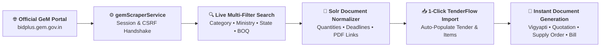

# 🌐 GeM (Government e-Marketplace) Open Tender Explorer & Importer

The **GeM Open Tender Explorer** module in TenderFlow AI allows contractors, vendors, and businesses to search, filter, analyze, and instantly import live government bids published on India's official [Government e-Marketplace (GeM)](https://bidplus.gem.gov.in) portal with a single click.

---

## ⚡ Key Capabilities

1. **Multi-Vector Search Engine**:
   - **Bid Number Search**: Direct lookup by specific GeM Bid/RA ID.
   - **Product & Category Search**: Live search across hundreds of procurement categories.
   - **Ministry & Department Search**: Filter bids by central/state ministries, organizations, and buyer departments.
   - **Geographic Location Search**: Search by buyer state and city.
   - **BOQ (Bill of Quantities) Search**: Search by custom BOQ tender titles and estimated tender budget values.

2. **Full Tender Details & Document Retrieval**:
   - Total item quantities and detailed line-item specifications.
   - Bid start date and countdown to submission deadlines.
   - Direct download links for official GeM Bid PDFs and Corrigendum notices.
   - Badges for Reverse Auction (RA), Bunch bids, High-Value tenders, and Single-Packet bids.

3. **1-Click Auto-Import Workflow**:
   - Clicking **"Import to TenderFlow"** transfers the tender title, line items, quantities, and submission deadline directly into the Tender Creation Suite.
   - Instantly triggers bilingual Hindi transliteration, rate calculations, and multi-firm quotation drafting without manual data re-entry.

---

## 🛠️ Architecture & API Endpoints

| Endpoint | Method | Purpose |
| :--- | :---: | :--- |
| `/api/gem/bids` | `POST` | Executes Solr-backed search queries against GeM Advance Search with session/CSRF token management. |
| `/api/gem/options` | `POST` | Fetches dynamic dropdown options (Ministries, States, Departments, Organizations). |
| `/api/gem/corrigendum` | `POST` | Retrieves corrigendum notices and addendums for active bids. |

---

## 🚀 Usage Guide

1. Navigate to **Dashboard** and click **"GeM Open Tenders"** (or visit `/tenders/open`).
2. Select your desired search tab (*Bid Number*, *Ministry*, *Location*, or *BOQ*).
3. Set your date range and search keywords, then click **Search Tenders**.
4. Browse search results, inspect line items, and click **"Import to TenderFlow"**.
5. Finalize firm selection and generate your **Vigyapti**, **Quotations**, **Supply Orders**, and **GST Bills** in 60 seconds!
